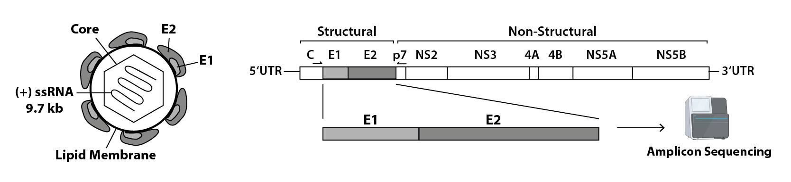

#  Hepacivirus glycoprotein intra-host evolution
In this project we analyzed the glycoprotein heterogeneity of the Equine Hepacivirus (EqHV) in horses :racehorse: and Hepatitis C virus (HCV) in humans :standing_person:.

**Detailed information in [Goemer, Todt 2022](https://pages.github.com/).**

**Background**

Even 30 years after the discovery of hepatitis C virus (HCV) in humans there is still no prophylactic vaccine available. Reasons for this include the high mutation rate of HCV, which allows the virus to escape immune recognition, in addition to the absence of an immunocompetent animal model for vaccine development. Phylogenetically distinct hepaciviruses (genus Hepacivirus, family Flaviviridae) have been isolated from diverse species, each with a narrow host range: the equine hepacivirus (EqHV) is the closest known relative of HCV.

**Methods**

Here we used amplicon-based deep-sequencing to investigate the viral intra-host population composition of the genomic regions encoding the surface glycoproteins E1 and E2. Patterns of E1E2 substitutional evolution were compared in longitudinally sampled EqHV positive sera of (naturally and experimentally infected horses) and HCV-positive patients. 

## Data
Raw read data is available at SRA Bioproject: [PRJNA785969](http://www.ncbi.nlm.nih.gov/bioproject/785969)

## Usage
**Processing and data analysis:**
Raw reads are trimmed and quality checked by running autoTrim.sh. Virus population analysis is conducted via Diversity.sh. Output data includes files with information on nucleotide (entropy, dNdS) and aminoacid (AA) diversity as well as codon count tables.

To run Diversity.sh please adjust path variables according to your data and installation setup - see lines 7 to 36.

The following packages were used:
- Trimmomatic
- FastQC
- Tanoti
- samtools
- GATK Markduplicates
- SAMTOCONSENSUS
- vNvS
- Diversitools
- CliqueSNV

**Visualize data in R:**
Import Diversity.sh output into R using the readdata.R script, which concatenates the files of all individuals into dataframes.
Those dataframes are used for visualization in the following R scripts: 
- *_variantplots.R: Variant characterization on nucleotide level
- Variantplots.R: Aminoacid variants in EqHV and HCV population
- window_approach.R: Sliding window analysis

 

---
**Correspondence**

Computational Virology  
Ruhr University Bochum  
computational-virology@ruhr-uni-bochum.de  
https://www.ruhr-uni-bochum.de/virologie/  
